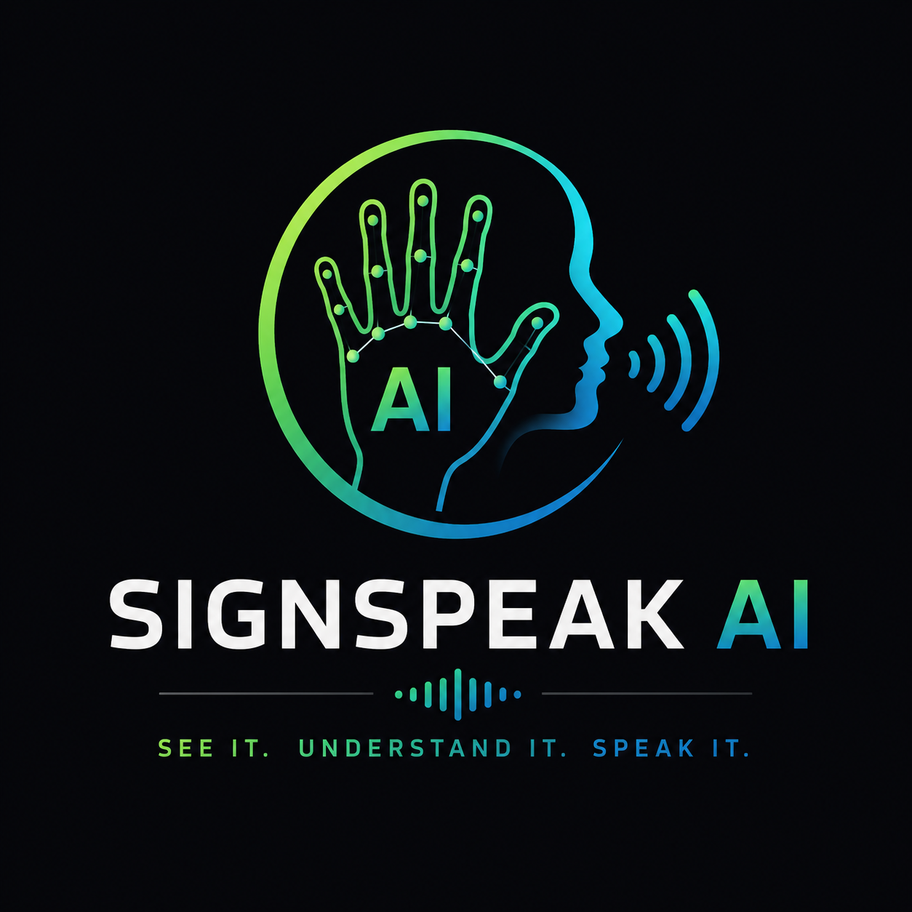

<p align="center">
  
</p>

<h1 align="center">🤖 SignSpeak AI</h1>

<p align="center">
<b>See It • Understand It • Speak It</b>
</p>

---

# 📌 Project Overview

SignSpeak AI is an Artificial Intelligence based Hand Gesture Recognition System that detects hand gestures in real time and converts them into spoken words using Machine Learning.

The project is developed using Python, OpenCV, MediaPipe and Scikit-Learn.

---

# ✨ Features

- ✋ Real-Time Hand Gesture Detection
- 🤖 AI-Based Gesture Recognition
- 🔊 Voice Output
- 📷 Live Camera Feed
- 📊 Stable Prediction using Majority Voting
- 🎨 Professional User Interface
- ⚡ Fast and Accurate Detection

---

# 🛠 Technologies Used

- Python
- OpenCV
- MediaPipe
- NumPy
- Pandas
- Scikit-Learn
- Joblib
- Pickle

---

# 📂 Project Structure

```
SignSpeakAI
│
├── assets
│   └── logo.png
│
├── dataset
│
├── models
│
├── src
│   ├── predictor.py
│   ├── hand_tracker.py
│   ├── collect_data.py
│   ├── clean_dataset.py
│   ├── train_model.py
│   ├── speech.py
│   └── camera.py
│
└── README.md
```

---

# ▶️ How to Run

### Install Required Libraries

```bash
pip install opencv-python mediapipe numpy pandas scikit-learn joblib pyttsx3
```

### Run the Project

```bash
cd src
py -3.11 predictor.py
```

---

# 📸 Output

- Detects Hand Gestures
- Displays Gesture Name
- Speaks Detected Gesture
- Shows Live Camera Feed

---

# 🚀 Future Scope

- More Sign Language Gestures
- Sentence Formation
- Mobile Application
- Multi-language Voice Output
- Deep Learning Integration

---

# 👩‍💻 Developed By

**Bhavya Maheshwari**