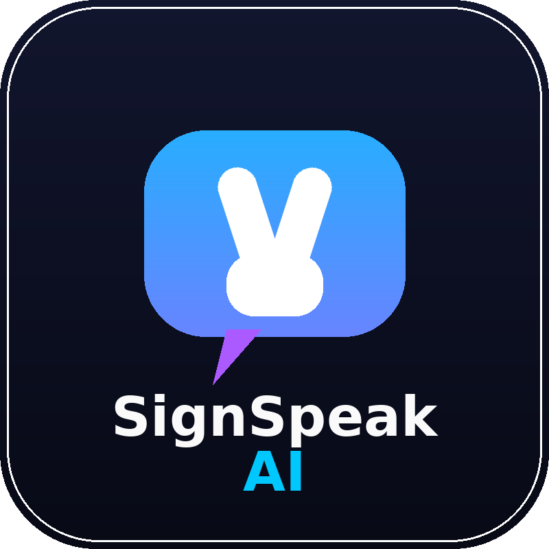

<p align="center">
  
</p>

# 🤖 SignSpeak AI

**See It • Understand It • Recognize It**

---

# 📌 Project Overview

SignSpeak AI is an Artificial Intelligence based Hand Gesture Recognition System that detects and recognizes hand gestures in real time using Machine Learning.

The project is developed using Python, OpenCV, MediaPipe, and Scikit-Learn to provide fast and accurate gesture recognition with a professional user interface.

It has two modes:

- **Gesture Mode (default)** — recognizes hand gestures live from your webcam using a trained Random Forest model.
- **Write Mode** — press `W` to open a drawing canvas where you can handwrite letters/words with your mouse; they're recognized with Tesseract OCR and added to a running sentence.

---

# ✨ Features

- ✋ Real-Time Hand Gesture Recognition
- 🤖 AI-Based Gesture Classification
- ✍️ Write Mode with handwriting-to-text (OCR) and sentence building
- 📷 Live Camera Feed
- 📊 Stable Prediction using Majority Voting
- 🎨 Professional Fullscreen User Interface
- 🟢 LIVE Status Indicator
- 🕒 Real-Time Date & Time Display
- 📦 Hand Bounding Box Detection
- ⚡ Fast and Accurate Recognition

---

# 🛠 Technologies Used

- Python
- OpenCV
- MediaPipe
- NumPy
- Pandas
- Scikit-Learn
- Joblib
- Pickle
- Tesseract OCR (via `pytesseract`) — used by Write Mode

---

# 📂 Project Structure

```
SignSpeakAI
│
├── assets
│   └── logo.png
│
├── dataset
│   ├── gestures.csv            (generated by collect_data.py)
│   └── gestures_clean.csv      (generated by clean_dataset.py)
│
├── models
│   ├── gesture_model.pkl       (generated by train_model.py)
│   ├── label_encoder.pkl       (generated by train_model.py)
│   └── model_info.json         (generated by train_model.py)
│
├── src
│   ├── paths.py                # central path config, used by every script
│   ├── hand_tracker.py         # MediaPipe hand landmark detection
│   ├── camera.py                # lightweight hand-detection preview
│   ├── predictor.py            # full app: Gesture Mode + Write Mode
│   ├── collect_data.py         # record training samples from webcam
│   ├── clean_dataset.py        # remove malformed rows before training
│   └── train_model.py          # train the Random Forest classifier
│
├── app.py                      # single entry point (menu-driven)
├── requirements.txt
└── README.md
```

---

# ▶️ How to Run

### 1. Install Tesseract OCR (required for Write Mode)

Write Mode's handwriting recognition uses Tesseract, which is a separate
program (not just a Python package):

- **Windows:** download the installer from the
  [Tesseract OCR project](https://github.com/UB-Mannheim/tesseract/wiki)
  and make sure it's added to your system PATH.
- **macOS:** `brew install tesseract`
- **Linux:** `sudo apt install tesseract-ocr`

If Tesseract isn't found, the app still runs — Write Mode just disables
the "ADD WORD" recognition and tells you so on screen.

### 2. Install Python dependencies

```
pip install -r requirements.txt
```

### 3. (First time only) Collect gesture data and train the model

```
cd src
python collect_data.py --label palm_open --samples 100
python collect_data.py --label thumbs_up --samples 100
# ... repeat for each gesture you want to recognize

python clean_dataset.py
python train_model.py
cd ..
```

### 4. Run the app

From the project root:
```
python app.py
```

Or run the full app directly from inside `src/`:
```
cd src
python predictor.py
```

---

# 🎮 Controls

**Gesture Mode**
- `W` → switch to Write Mode
- `Q` → quit

**Write Mode**
- Draw with your mouse inside the white canvas
- `A` → recognize what's written and add it to the sentence
- `C` → clear canvas
- `N` → start a new sentence
- `U` → undo last stroke
- `1` / `2` / `3` / `4` → red / green / blue / yellow pen
- `E` → eraser
- `W` → back to Gesture Mode
- `Q` → quit
- All of the above also have clickable on-screen buttons

---

# 📸 Output

- Detects Hand Gestures in Real Time
- Displays the Recognized Gesture Name
- Handwriting recognition and sentence building in Write Mode
- Shows Live Camera Feed
- Displays Live Date & Time
- Highlights the Detected Hand with a Bounding Box

---

# 🚀 Future Scope

- Support for More Sign Language Gestures
- Emergency Communication Support
- Mobile Application
- Deep Learning Integration
- Multi-Language Gesture Recognition
- Text-to-speech output for recognized gestures/sentences

---

# 👩‍💻 Developed By

**Bhavya Maheshwari**
